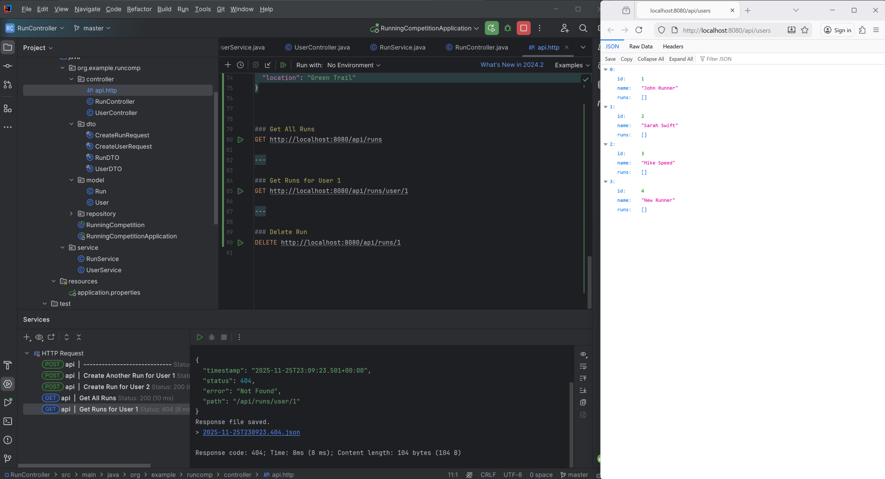
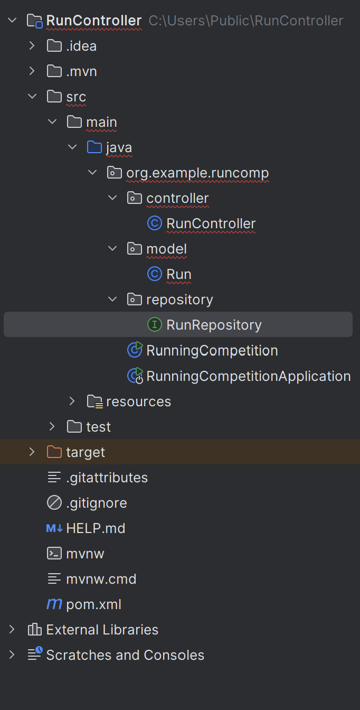

# 🏃 Running Competition API

A Spring Boot REST API for managing running competitions, runners, and performance tracking.

This project was built to combine my interest in running with backend development, focusing on RESTful API design, database interaction, and clean architecture.

---

## 🚀 Features

- Register runners
- Create and manage competitions
- Track rankings and performance statistics
- RESTful API architecture
- Spring Data JPA persistence
- Optional JNI integration with C++ for performance

---

## 🛠️ Tech Stack

- Java 17
- Spring Boot
- Spring Data JPA
- H2 / MySQL (configurable)
- Maven
- JNI (Java ↔ C++)

---

## ▶️ Running the Project

To start the API locally:

```bash
mvn spring-boot:run
```

---

## 📸 Screenshots

### 🏃 Users Endpoint


### 📋 Full API Demo


### 🗂️ Project Structure


---

## 📚 What I Learned

Through this project I improved my understanding of:

- REST API development
- Spring Boot architecture
- Database persistence with JPA
- API testing with Postman
- Backend project structure
- Java and C++ interoperability using JNI

---

## 👨‍💻 Author

Peter-c-dev
